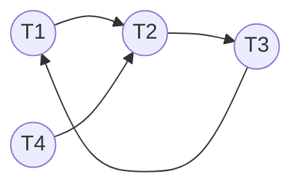

# Deadlock
- when transaction $T$ waits for a lock, it is **blocked**
- a **deadlock** (permanent block) occurs when 2+ transactions are blocked, and **waiting for each other** to release locks
- example
	- $$\begin{bmatrix}
T1 & T2 \\
X(A) & \\
R(A) & \\
W(A) & \\
& X(B) \\
& R(B) \\
& W(B) \\
& R(A) \\
& ... \\
R(B) & \\
... & \\
\end{bmatrix}
$$
	- mutually blocked on final reads
## Handling
### Detection
- create a **waits-for** graph
	- nodes are transactions
	- edge from $T_i$ to $T_j$ if $T_i$ is waiting for $T_j$ to release a lock
	- [[Lock Manager]]
		- adds edges when queueing a lock request
		- removes edges when grnating a lock request
	- periodically check for cycles in graph
		- iff cyclic, deadlock is present
	- example
		- ![[Pasted image 20250325034450.png]]
		- $$
		\begin{bmatrix}
T1 & T2 & T3 & T4 \\
S(A) & & & \\
R(A) & & & \\
& X(B) & & \\
& W(B) & & \\
S(B) & & & \\
& & S(C) & \\
& & R(C) & \\
& X(C) & & \\
& & & X(B) \\
& & X(A) & \\
		\end{bmatrix}
		    $$

- alternatively, use **timeouts**
	- abort if waiting too long for locks
### Recovery
- transaction in cycle in waits-for graph is **picked and aborted**
	- choices could be based on
		- number of locks held
		- work done or remaining work
		- times of being aborted
### Prevention