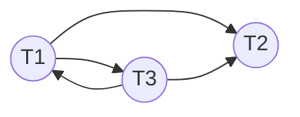

---
aliases:
  - Serializability Graph
---
# Precedence Graph
- one node per transaction
- edge from $T_i$ to $T_j$ if 
	- $T_i$ executes W(A) **before** $T_j$ executes R(A) or W(A)
	- $T_i$ executes R(A) **before** $T_j$ executes W(A)
- **theorem**: schedule is [[Conflict Serializable Schedule|Conflict Serializable]] if its precedence graph is **acyclic**
	- topological sort over graph produces equivalent serial schedule
## Example
$$
S = \begin{bmatrix}
T1 & T2 & T3 \\
R(A)
\end{bmatrix}
$$

